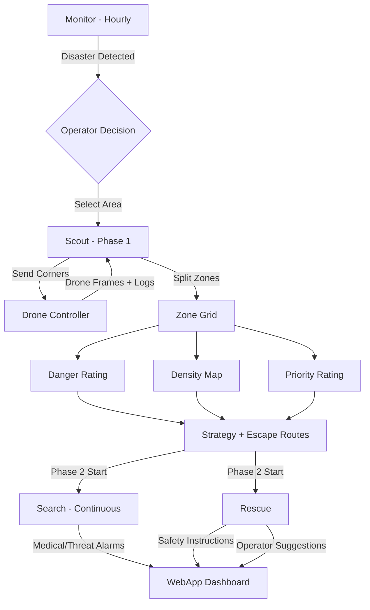

<p align="center">
  
</p>

<h3 align="center">AI-Powered Search and Rescue Drone Swarm Coordination Platform</h3>

<p align="center">
  <em>Real-time disaster monitoring -- Autonomous drone scouting -- Intelligent rescue strategy generation</em>
</p>

---

## What is ResQNet?

**ResQNet** is an end-to-end platform that combines **AI reasoning**, **drone swarm coordination**, and a **real-time operator dashboard** to accelerate search-and-rescue operations during natural disasters.

The system monitors social media for emerging disasters, deploys autonomous drone swarms to survey affected areas, and generates actionable rescue strategies -- all in real time.

---

## Pipeline Flow


---

## Modules

| Module | Description | Port |
|---|---|---|
| [**Reasoning Agent**](Resoning%20Agent/) | AI core -- 4-phase pipeline with LLM/VLM reasoning, detection, heatmaps, and rescue strategy generation | 8000-8003, 8080 |
| [**Drone Controller**](Drone%20Controller/) | Unity-based drone swarm coordination, flight path management, live feed streaming, telemetry logging | 5000 |
| [**WebApp**](Webapp/) | Operator dashboard with maps, heatmaps, drone feeds, and rescue plans | 3000 |

---

## Operational Phases

### Phase 0 -- Monitor (Always Running)
- Scrape X (Twitter) trending topics for potential disasters using twikit
- LLM-based classification and validation of disaster signals
- Deep-dive hashtag analysis for incident details (location, severity, type)
- Persistent reasoning context across monitoring sessions

### Phase 1 -- Scout (Stage 1)
- Dispatch drone swarm to selected geo-zone via Drone Controller API
- Analyze drone frames with VLM to detect buildings, people, fire, smoke, flood
- Split scouting zone into NxN grid, map drone frames to zones
- Generate per-zone danger rating, people density estimation, and rescue priority
- Produce full rescue strategy with phases and resource allocation
- Generate escape routes and safety zone recommendations

### Phase 2a -- Search (Stage 2)
- Continuously process new drone frames for updated detections
- VLM-based medical emergency detection with automatic alarm triggers
- VLM-based threat/risk detection requiring operator attention
- Active alarm queue for real-time operator notifications

### Phase 2b -- Rescue (Stage 2)
- VLM describes scene, LLM generates safety instructions for persons on ground
- VLM tactical assessment, LLM generates operator action plan and resource requests

### Unified Agent
- Single chat endpoint orchestrates all 4 phases via LLM tool-calling
- 21 tools available across Monitor, Scout, Search, Rescue, and Drone Controller
- Agentic loop with up to 10 chained tool calls per conversation turn
- Maintains conversation history for multi-turn reasoning

---

## Tech Stack

| Layer | Technologies |
|---|---|
| **AI Models** | OpenRouter (LLM + VLM), configurable model selection |
| **Backend** | Python 3.11+, FastAPI, Uvicorn, httpx |
| **Drone Sim** | Unity (C#), PID controllers, APF navigation |
| **Social Intel** | twikit (X/Twitter scraping without API key) |
| **Infrastructure** | Pydantic v2, Loguru, python-dotenv |

---

## Quick Start

```bash
git clone https://github.com/MokhtarOuardi/ResQNet.git
cd ResQNet

# Set up Python environment
cd "Resoning Agent"
pip install -r requirements.txt

# Configure environment
# Create .env with your API keys

# Start all services
python monitor.py           # port 8000
python scout.py             # port 8001
python search.py            # port 8002
python rescue.py            # port 8003
python ResQnet_agent.py     # port 8080 (unified agent)

# Run the full flow test
python test_flow_simulation.py
```

See individual module READMEs for detailed setup and configuration instructions.

---

## Contact and Credits

Developed by **Mokhtar Ouardi**, **Adam Aburaya** and **Anas Aburaya** for the vhack Hackathon.

- **Mokhtar Ouardi**: [GitHub](https://github.com/MokhtarOuardi) | [Email](mailto:m.ouardi@graduate.utm.my)
- **Anas Aburaya**: [GitHub](https://github.com/Shadowpasha) | [Email](mailto:ameranas1923@gmail.com)
- **Adam Aburaya**: [GitHub](https://github.com/amer-adam) | [Email](mailto:ameradam6a@gmail.com)

---
© 2026 ResQnet Team. All rights reserved.
</CodeContent>
<parameter name="Complexity">5

## My Contributions

This project is based on the original ResQNet open-source implementation. I forked the project and extended it with a reproducible synthetic testing workflow for the Scout perception pipeline.

### What I Added

- Added a **DEMO_MODE** to the Scout service for testing the perception pipeline without requiring an external VLM API.
- Created a clearly labelled **synthetic drone dataset** containing simulated telemetry logs and test frames for four drones.
- Added deterministic synthetic VLM responses covering:
  - Buildings
  - People
  - Fire and smoke
  - Flooding
  - Vehicles
  - Debris
  - Road accessibility
- Validated the **4×4 search-zone partitioning pipeline**, producing 16 mission zones from drone telemetry.
- Validated frame-level detection using drone ID, frame number, GPS coordinates, altitude, and structured scene information.
- Added explicit labelling to ensure synthetic outputs are not confused with real drone imagery or real-world VLM analysis.

### Validation

The Scout pipeline was tested using four simulated drones with 50 frames of telemetry per drone.

Example validation:

```text
Total zones: 16
Zones with frames: 4

Drone 1, Frame 50:
GPS: x=15.0, y=7.5
Altitude: 50.0

Detected scene information:
- Buildings: 3
- People: 2
- Vehicles: 1
- Debris: detected
- Fire: not detected
- Flooding: not detected
