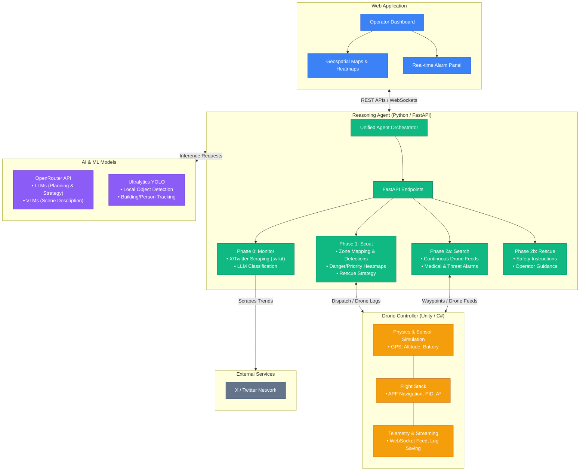

# ResQNet — Tech Stack Overview

This document outlines the end-to-end technology stack and module architecture for the **ResQNet** platform.

## Architecture Diagram



## Technology Stack Breakdown

### 1. Reasoning Agent
* **Language**: Python 3.11+
* **Framework**: FastAPI (Async REST routes), Uvicorn
* **HTTP/Async**: `httpx`, `asyncio`
* **Social Scraping**: `twikit` (Allows unauthenticated Twitter trend and hashtag scraping)
* **Infrastructure**: `pydantic` v2, `loguru` for structured logging, `python-dotenv`

### 2. AI & Machine Learning
* **LLM / VLM API**: OpenRouter unified API
* **Base Models**: `google/gemma-3-4b-it:free` (VLM) & `stepfun/step-3.5-flash:free` (LLM)
* **Local Computer Vision**: Ultralytics YOLOv8/v11 (building detection, people counting, disaster identification)

### 3. Drone Swarm Controller
* **Engine**: Unity 3D Engine (C#)
* **Flight Dynamics**: Custom PID tuning and Artificial Potential Field (APF) logic
* **Pathfinding**: Grid-based local mapping with A*
* **Telemetry Server**: Flask HTTP Server (`received_data_server.py`) on port 8080 for handling drone zip bundles and video stitching (`OpenCV`)

### 4. Web Application (Frontend)
* **Status**: Defining UI Framework
* **Expected Stack**: React, Leaflet/Mapbox for geospatial rendering, WebSockets for live video streaming and alarms.

### 5. Geospatial & Data Tools
* **Mapping**: Expected use of `GeoPandas`, `Folium` for heatmap generation.
* **Image Processing**: `Pillow`, `OpenCV` (cv2) for drone feed pre-processing and video compilation.

## My Contributions

This project is based on the original ResQNet open-source implementation. I forked the project and extended it with a reproducible synthetic testing workflow for the Scout perception pipeline.

### What I Added

- Added a **DEMO_MODE** to the Scout service for testing the perception pipeline without requiring an external VLM API.
- Created a clearly labelled **synthetic drone dataset** containing simulated telemetry logs and test frames for four drones.
- Added deterministic synthetic VLM responses covering:
  - Buildings
  - People
  - Fire and smoke
  - Flooding
  - Vehicles
  - Debris
  - Road accessibility
- Validated the **4×4 search-zone partitioning pipeline**, producing 16 mission zones from drone telemetry.
- Validated frame-level detection using drone ID, frame number, GPS coordinates, altitude, and structured scene information.
- Added explicit labelling to ensure synthetic outputs are not confused with real drone imagery or real-world VLM analysis.

### Validation

The Scout pipeline was tested using four simulated drones with 50 frames of telemetry per drone.

Example validation:

```text
Total zones: 16
Zones with frames: 4

Drone 1, Frame 50:
GPS: x=15.0, y=7.5
Altitude: 50.0

Detected scene information:
- Buildings: 3
- People: 2
- Vehicles: 1
- Debris: detected
- Fire: not detected
- Flooding: not detected

                    ┌──────────────────────┐
                    │   Drone Telemetry    │
                    │  + Synthetic Frames  │
                    └──────────┬───────────┘
                               │
                               ▼
                    ┌──────────────────────┐
                    │    SCOUT AGENT       │
                    │                      │
                    │ Zone Partitioning    │
                    │ VLM Perception       │
                    │ Scene Understanding  │
                    └──────────┬───────────┘
                               │
              ┌────────────────┼────────────────┐
              ▼                ▼                ▼
        ┌───────────┐    ┌───────────┐    ┌───────────┐
        │  Danger   │    │   People  │    │  Rescue   │
        │ Analysis  │    │  Density  │    │ Priority  │
        └─────┬─────┘    └─────┬─────┘    └─────┬─────┘
              └────────────────┼────────────────┘
                               ▼
                    ┌──────────────────────┐
                    │ Mission Strategy     │
                    │ & Route Planning     │
                    └──────────┬───────────┘
                               ▼
                    ┌──────────────────────┐
                    │ Drone Controller     │
                    │ + Web Dashboard      │
                    └──────────────────────┘